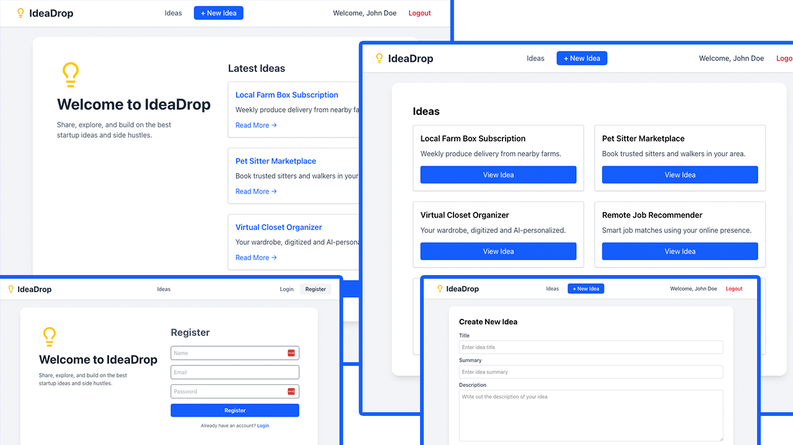

# IdeaDrop UI

This is the frontend to the IdeaDrop application from BradTraversy React course.
It uses React, TanStack Router, and TanStack Query.



## Features

- User registration and login
- JWT-based authentication with automatic token refresh
- Create, read, update, and delete (CRUD) ideas
- Protected routes for creating and editing ideas
- Responsive and clean UI
- Built with:
  - React (via Vite)
  - TanStack Router
  - TanStack Query
  - Axios

## Usage

Install dependencies:

```bash
npm install
```

Run dev server:

```bash
npm run dev
```

## Environment Variables

Rename example.env to .env:

```
VITE_API_URL=http://localhost:5000/api
```

Change the value if your API runs on a different port or host.

## Authentication Flow

- Login/register returns an accessToken and sets a refreshToken in a secure, HTTP-only cookie.

- accessToken is stored in context and sent in the Authorization header.

- When the access token expires or there is a hard page refresh, the app automatically requests a new one using the refreshToken.
